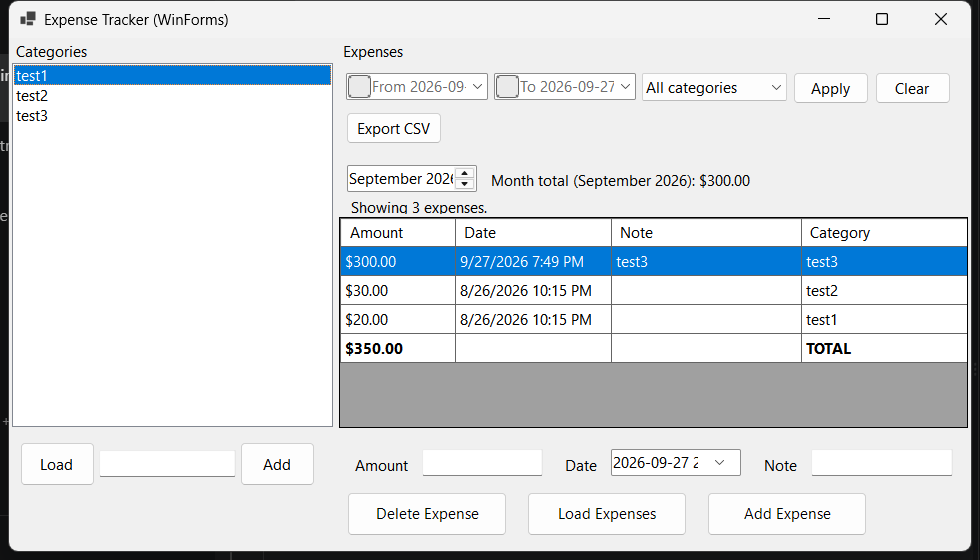
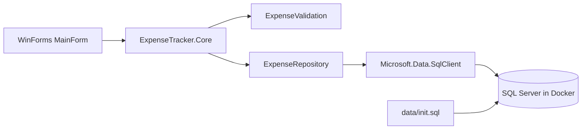

# Expense Tracker

## Overview

- WinForms desktop app for managing personal expenses.
- SQL Server runs in Docker for a repeatable Windows setup.
- The schema source of truth is [data/init.sql](data/init.sql); database files are not stored in Git.
- This is a portfolio project for local demonstration, not a production system with a server-side trust boundary.

The app helps a single local user track expenses by category, amount, date, and note. It supports adding categories and creating, viewing, editing, and deleting expenses; date-range and category filters, monthly totals, filtered totals, and CSV export help review spending.



## What this project demonstrates

- C# and .NET 10 WinForms event-driven desktop UI.
- Separation between the WinForms UI, platform-neutral `ExpenseTracker.Core` validation/summary rules, and SQL access (`ExpenseRepository`).
- Parameterized SQL with explicit SQL types and `DECIMAL(18,2)` handling.
- SQL Server schema initialization, Docker Compose persistence, and repeatable Windows setup.
- Database-independent unit tests plus separately tagged local integration tests.

This is intentionally a small desktop portfolio project, not a web service or a production personal-finance platform.

## Requirements

- Windows 10/11
- Docker Desktop
- Git
- .NET SDK 10 when building from source

## Quick start

From the repository root, run setup:

```powershell
powershell -NoProfile -ExecutionPolicy Bypass -File .\scripts\setup\setup-all.ps1
```

To start Docker and initialize the database without launching the app (using the saved admin credential when available):

```powershell
powershell -NoProfile -ExecutionPolicy Bypass -Command "& .\scripts\setup\setup-all.ps1 -RunApp:`$false"
```

The setup script starts SQL Server without force-recreating the container and, when it has the local admin credential, applies the idempotent [data/init.sql](data/init.sql) schema/migration script. The script preserves existing rows and refuses to apply the data-integrity migration if legacy category names are blank/space-padded or duplicate ignoring case, or if existing expenses have non-positive amounts. Resolve these cases deliberately before retrying; setup never deletes existing data to force a migration. SQL Server binds to loopback port 1433 and uses container name `expense-mssql` by default; set `EXPENSE_TRACKER_SQL_PORT` and optionally `EXPENSE_TRACKER_CONTAINER_NAME` in the process environment to run an isolated local instance. A small root startup step fixes ownership on the Docker-managed data directory when needed, then launches `sqlservr` as the non-root `mssql` user. Setup creates or verifies a restricted `ExpenseApp` SQL login, builds, and optionally launches the WinForms app.

On first setup, the script generates the SQL Server SA password automatically and protects it with Windows DPAPI for the current Windows user at `%LOCALAPPDATA%\ExpenseTracker\sql-admin-password.bin`. The application credential is separately generated and protected at `%LOCALAPPDATA%\ExpenseTracker\app-db-password.bin`; the app connection string is passed only to the app process. On later runs from the same Windows profile, setup reuses the saved local admin credential and applies migrations without asking for a password. If a pre-existing container has no locally saved admin credential, ordinary app startup reuses the protected `ExpenseApp` login and does not change or recreate the database; provide the existing SA password explicitly with `-saPassword` only when an admin operation such as applying migrations is needed. These local credentials are not committed to the repository and are not intended as production secrets. If SQL Server rejects an admin credential, stop and recover the correct credential; do not delete the volume as a troubleshooting shortcut.

The application login is limited to `db_datareader` and `db_datawriter` in `ExpenseDb` instead of SQL Server administrator access. Category names are trimmed, non-empty, and unique ignoring case; SQL Server enforces the rule as well as the UI. The database port is bound to `127.0.0.1`, not exposed to other machines on the network. The SQL Server volume is persistent. Setup preserves existing database contents and does not repair permissions or recreate the volume automatically.

## Reviewer demo

After setup, the main window loads categories and expenses automatically. A new database includes Food, Transport, Bills, and Other categories, but no fabricated expense history.

1. Select a category and enter a positive amount.
2. Add the expense and confirm it appears in the table and total.
3. Filter by date range or category; both date bounds are inclusive. The monthly total uses the selected month and category independently of the grid date range. Use **Clear** to reset the filters and month.
4. Double-click the expense row, change a field, and click **Save Changes**. Press Escape to cancel editing.
5. Delete that expense and confirm the total updates after the confirmation prompt.
6. Export the currently filtered grid expenses to CSV; the export omits the display-only total row.
7. Add a category, restart the app, and confirm the category persists.

For an interview walkthrough, explain the split between the WinForms UI, `ExpenseValidation`, `ExpenseRepository`, SQL Server, and the database initialization script. The repository deliberately remains a local single-user demo; it does not claim multi-user security.

### Architecture



`MainForm` owns layout, input binding, and user-facing status. The platform-neutral `ExpenseTracker.Core` project contains typed category/expense/filter models, amount/category validation, `ExpenseOverviewService` query orchestration, CSV serialization, monthly summaries, and asynchronous `ExpenseRepository` methods with parameterized SQL and explicit SQL types. `data/init.sql` creates the schema, adds starter categories when needed, and tracks additive migrations.

The CSV export uses invariant decimal/date formats, quotes CSV special characters, and prefixes formula-leading fields to reduce spreadsheet formula injection risk. Grid dates are inclusive; monthly totals deliberately ignore the grid's date range while honoring the selected category.

The form resizes to the available screen area. The screenshot above was captured from the running WinForms app and shows the filter actions fully visible alongside the monthly summary and expense grid. The grid uses DPI-aware column sizing to fill the available viewport without an unnecessary horizontal scrollbar; the UI regression checks this at the default size and 800x600.

### Engineering decisions

- **WinForms + SQL Server** keeps the project focused on native Windows desktop development and relational data handling. Docker Compose makes the database repeatable for local setup without requiring SQL Server to be installed directly on the host.
- **Core/repository separation** keeps validation, query orchestration, and SQL access outside the form where those behaviors can be tested independently. The form still owns layout and interaction orchestration; this is a small app, so it does not introduce a UI framework or a broad MVVM rewrite.
- **Direct SQL from the desktop client** is an intentional single-user demo trade-off, not a production security boundary. A desktop executable can be inspected and its local SQL permissions can be reused. Supporting multiple users would require a trusted server-side API, authentication, and ownership checks for every operation.
- **Persistent database data is preserved by setup and migrations.** Unsafe legacy data stops migration for deliberate manual resolution instead of being silently merged or deleted.

## Run again

Run `setup-all.ps1` again to start the service and app. Starting Docker Compose alone will not pass the process-scoped connection to a manually launched app.

## Tests

Database-independent core and unit tests:

```powershell
powershell -NoProfile -ExecutionPolicy Bypass -File .\scripts\tests\run-unit-tests.ps1
```

Integration tests default to the local Docker service and allow only `ExpenseDb` on loopback port 1433. A separately created disposable instance can be tested on another loopback port by setting `SQL_CONN` and passing `-Port`; see [docs/TESTING_GUIDE.md](docs/TESTING_GUIDE.md). The test refuses other hosts or databases:

```powershell
powershell -NoProfile -ExecutionPolicy Bypass -File .\scripts\tests\run-integration-tests.ps1
```

UI tests require an interactive Windows desktop and a clean, disposable `ExpenseDb`: the CRUD flow checks exact row counts, creates test data, and removes its uniquely named category and expenses during teardown. The default test mode uses the regular local Docker database; use a disposable SQL Server on another loopback port for a repeatable, isolated full UI run. That mode sets `SQL_CONN`, passes `-Port`, skips repository database setup, and rejects non-local hosts, another database, or port 1433. See [docs/TESTING_GUIDE.md](docs/TESTING_GUIDE.md) for details. GitHub Actions builds and runs unit tests on Windows and runs repository integration tests against a disposable SQL Server container on Ubuntu; interactive UI tests remain local/manual.

## Release bundle

Download the current [Expense Tracker v0.3.10 Windows x64 release](https://github.com/Dangne0201/expense-tracker/releases/tag/v0.3.10), or build a self-contained review bundle locally:

```powershell
powershell -NoProfile -ExecutionPolicy Bypass -File .\scripts\setup\create-release.ps1 -Version "0.3.11"
```

The generated ZIP is ignored by Git because it is a large build artifact. Release creation refuses a dirty worktree and includes the full source commit in `BUILD-INFO.txt`, so the bundle maps to one committed source state. It prints a SHA-256 checksum after packaging; record that value in the release notes and verify it after download. Bundles generated from the current setup scripts create and protect the local SQL Server admin credential with Windows DPAPI, provision the restricted `ExpenseApp` login, and contain no database password. A reviewer still needs Docker Desktop because SQL Server runs in a container. Only distribute a bundle after isolated database, UI, and startup checks in [docs/TESTING_GUIDE.md](docs/TESTING_GUIDE.md) pass and CI is green for that source commit.

The currently published `v0.3.10` bundle was built from source commit `ca858d1`, before the latest setup and UI improvements; its SHA-256 is `EB718C9D56F1F59BC089273360A7176BCED23F06D57A10D8B19BD64A2C8EF4F6`. The published bundle retains its password-prompt behavior. Build and verify a new version from the updated source before distributing these newer changes.

## Troubleshooting

- Docker is not running: open Docker Desktop.
- Port 1433 is occupied: stop the conflicting SQL Server or change the port consistently in `docker-compose.yml` and the connection string.
- SQL Server is not ready: inspect `docker logs expense-mssql`.
- If an existing `expense-mssql` container still shows `0.0.0.0:1433` or `[::]:1433`, normal setup can reuse the saved `ExpenseApp` login to start the app but cannot update an existing container's configuration without its SA credential. Provide the existing SA password with `-saPassword` for this administrative setup path; then verify `docker ps`. Normal setup preserves the named database volume; never use `docker compose down -v` for this.
- If the app cannot connect, run setup again to reuse the saved local credentials and check `docker compose logs mssql`. For an existing volume that has no saved SA credential, setup uses the protected `ExpenseApp` login for normal startup; provide the existing SA password only for administrative work such as migrations. Do not use `docker compose down -v` as a troubleshooting step: it permanently removes local database data.
- If the DPAPI app credential cannot be decrypted, preserve the database volume. After confirming the SA password and current Windows user, remove only `%LOCALAPPDATA%\ExpenseTracker\app-db-password.bin` and rerun setup to create a replacement restricted login; this does not reset expense data.

## Structure

- `src/ExpenseTracker.WinForms`: WinForms UI and user-facing orchestration.
- `src/ExpenseTracker.Core`: typed models, validation, query orchestration, CSV export, and SQL repository.
- `src/ExpenseTracker.Tests`: validation, repository checks, and opt-in integration tests.
- `src/ExpenseTracker.UiTests`: interactive FlaUI launch and CRUD/edit/cancel/restart tests.
- `data/init.sql`: database schema and safe starter categories.
- `scripts/setup`: Docker/setup and release helpers.
- `scripts/tests`: unit, integration, UI, and smoke-test entry points.
- `.github/workflows/dotnet.yml`: build and unit-test CI.

## Known limitations

- There is no account, authorization, or per-user ownership model yet.
- The desktop client connects directly to SQL Server. This is acceptable for a local demo, but it is not a production security boundary.
- The local application login is restricted to database reader/writer roles, but a desktop client can still be inspected and can access all rows in this single-user database. A real multi-user system needs a trusted server-side service and ownership checks on every operation.
- The DPAPI-protected application credential is tied to the Windows user/profile that created it. It is not a portable credential or production identity system.
- LocalDB/MDF fallback remains for compatibility; Docker is the documented primary path.
- The app supports create/read/update/delete for expenses and create/read for categories; it has no category edit/delete or reporting dashboard.
- Setup uses the local SQL Server SA credential only to provision the database and restricted `ExpenseApp` login. The app uses `ExpenseApp`, not the SA account. This local credential model is still not a production security boundary.
- The README screenshot is a UI capture from the running app; it is not evidence that the shown data came from a disposable database. No screen recording is included.
- UI automation requires an interactive Windows desktop and is not run by GitHub-hosted CI. SQL integration tests run separately against an ephemeral SQL Server container.
- Runtime diagnostic logs are written to `%LOCALAPPDATA%\ExpenseTracker\logs\application.log`; they record operation, exception type, and SQL error number, not the connection string or password.

## Repository hygiene

Do not commit `.env`, connection files, database binaries, build output, test results, logs, or passwords. Earlier release ZIPs, including bundles with a hard-coded example credential, are not part of the current source tree. They may remain in Git history; do not restore or distribute them.
