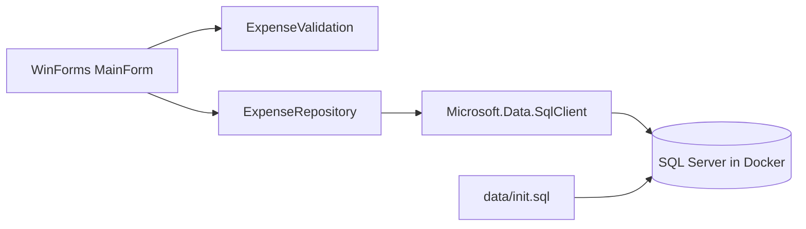

# Expense Tracker

## Overview

- WinForms desktop app for managing personal expenses.
- SQL Server runs in Docker for a repeatable Windows setup.
- The schema source of truth is [data/init.sql](data/init.sql); database files are not stored in Git.
- This is a portfolio project for local demonstration, not a production system with a server-side trust boundary.

The app helps a single local user track expenses by category, amount, date, and note. It supports adding categories and creating, viewing, editing, and deleting expenses; the table displays a total of the loaded expenses.


## What this project demonstrates

- C# and .NET 10 WinForms event-driven desktop UI.
- Separation between UI (`MainForm`), input rules (`ExpenseValidation`), and SQL access (`ExpenseRepository`).
- Parameterized SQL with explicit SQL types and `DECIMAL(18,2)` handling.
- SQL Server schema initialization, Docker Compose persistence, and repeatable Windows setup.
- Database-independent unit tests plus separately tagged local integration tests.

This is intentionally a small desktop portfolio project, not a web service or a production personal-finance platform.

## Requirements

- Windows 10/11
- Docker Desktop
- Git
- .NET SDK 10 when building from source

## Quick start

From the repository root, run setup. It prompts for the local SQL Server SA password without echoing it:

```powershell
powershell -NoProfile -ExecutionPolicy Bypass -File .\scripts\setup\setup-all.ps1
```

To start Docker and initialize the database without launching the app:

```powershell
powershell -NoProfile -ExecutionPolicy Bypass -File .\scripts\setup\setup-all.ps1 -RunApp:$false
```

The setup script starts SQL Server without force-recreating the container, waits for SQL readiness, and runs [data/init.sql](data/init.sql) only if `ExpenseDb` does not exist. A small root startup step fixes ownership on the Docker-managed data directory when needed, then launches `sqlservr` as the non-root `mssql` user. Setup creates or verifies a restricted `ExpenseApp` SQL login, builds, and optionally launches the WinForms app. The application credential is randomly generated and protected with Windows DPAPI for the current user at `%LOCALAPPDATA%\ExpenseTracker\app-db-password.bin`; the connection string is passed only to the app process. The SA password is used only by local setup and is not written to a batch file, connection file, or user-level environment variable. Use the same SA password on later runs. If the existing volume rejects it, stop and recover the correct password; do not delete the volume as a troubleshooting shortcut.

The application login is limited to `db_datareader` and `db_datawriter` in `ExpenseDb` instead of SQL Server administrator access. The database port is bound to `127.0.0.1`, not exposed to other machines on the network. The SQL Server volume is persistent. Setup preserves existing database contents and does not repair permissions or recreate the volume automatically.

## Reviewer demo

After setup, the main window loads categories and expenses automatically. A new database includes Food, Transport, Bills, and Other categories, but no fabricated expense history.

1. Select a category and enter a positive amount.
2. Add the expense and confirm it appears in the table and total.
3. Double-click the expense row, change a field, and click **Save Changes**. Press Escape to cancel editing.
4. Delete that expense and confirm the total updates.
5. Add a category, restart the app, and confirm the category persists.

For an interview walkthrough, explain the split between the WinForms UI, `ExpenseValidation`, `ExpenseRepository`, SQL Server, and the database initialization script. The repository deliberately remains a local single-user demo; it does not claim multi-user security.

### Architecture



`MainForm` owns layout, input binding, and the displayed total. `ExpenseValidation` handles amount/category input rules. `ExpenseRepository` owns parameterized SQL and explicit SQL types. `data/init.sql` creates the schema and adds starter categories only when the category table is empty.

The form resizes to the available screen area. The screenshot above was captured from the running WinForms app against an isolated, disposable SQL Server database; its sample expenses were entered through the UI test flow.

## Run again

Run `setup-all.ps1` again with the same SA password to start the service and app. Starting Docker Compose alone will not pass the process-scoped connection to a manually launched app.

## Tests

Database-independent unit tests:

```powershell
powershell -NoProfile -ExecutionPolicy Bypass -File .\scripts\tests\run-unit-tests.ps1
```

Integration tests default to the local Docker service and allow only `ExpenseDb` on loopback port 1433. A separately created disposable instance can be tested on another loopback port by setting `SQL_CONN` and passing `-Port`; see [docs/TESTING_GUIDE.md](docs/TESTING_GUIDE.md). The test refuses other hosts or databases:

```powershell
powershell -NoProfile -ExecutionPolicy Bypass -File .\scripts\tests\run-integration-tests.ps1
```

UI tests require an interactive Windows desktop. The UI test script securely prompts for the database admin password, preserves/starts the local Docker database, passes the app connection only to the current test process, and builds the requested configuration. See [docs/TESTING_GUIDE.md](docs/TESTING_GUIDE.md) for prerequisites, rollback behavior, and manual QA. GitHub Actions runs restore, build, and database-independent tests only; wait for a successful workflow run before describing CI as green.

## Release bundle

Only the latest review bundle is kept in `artifacts`: [expense-tracker-v0.3.8-win-x64.zip](artifacts/expense-tracker-v0.3.8-win-x64.zip). It prompts for a local SA password and provisions the restricted `ExpenseApp` login; it does not include an application or database password. Bundle setup, credential creation/reuse, integration tests, and UI tests passed on this Windows profile with an isolated temporary Docker project/volume and a separate DPAPI credential file. The bundle predates the latest source UI layout adjustment, so rebuild and rerun its UI flow before distributing it as a build of the current source.

Earlier release ZIPs, including bundles with a hard-coded example database credential, were removed from the current source tree. They may still exist in Git history; do not restore or distribute them. If any real credential was ever used in those bundles, rotate it.

To create a later version without overwriting any existing archive:

```powershell
powershell -NoProfile -ExecutionPolicy Bypass -File .\scripts\setup\create-release.ps1 -Version "0.3.9"
```

The self-contained app still requires Docker Desktop because SQL Server runs in a container.

## Troubleshooting

- Docker is not running: open Docker Desktop.
- Port 1433 is occupied: stop the conflicting SQL Server or change the port consistently in `docker-compose.yml` and the connection string.
- SQL Server is not ready: inspect `docker logs expense-mssql`.
- If an existing `expense-mssql` container still shows `0.0.0.0:1433` or `[::]:1433`, rerun setup with the same SA password to apply the current loopback-only Compose binding, then verify `docker ps`. Normal setup preserves the named database volume; never use `docker compose down -v` for this.
- If the app cannot connect, run setup again with the same SA password and check `docker compose logs mssql`. Do not use `docker compose down -v` as a troubleshooting step: it permanently removes local database data.
- If the DPAPI app credential cannot be decrypted, preserve the database volume. After confirming the SA password and current Windows user, remove only `%LOCALAPPDATA%\ExpenseTracker\app-db-password.bin` and rerun setup to create a replacement restricted login; this does not reset expense data.

## Structure

- `src/ExpenseTracker.WinForms`: WinForms UI, validation, and SQL repository.
- `src/ExpenseTracker.Tests`: validation, repository checks, and opt-in integration tests.
- `src/ExpenseTracker.UiTests`: interactive FlaUI launch and CRUD/edit/cancel/restart tests.
- `data/init.sql`: database schema and safe starter categories.
- `scripts/setup`: Docker/setup and release helpers.
- `scripts/tests`: unit, integration, UI, and smoke-test entry points.
- `.github/workflows/dotnet.yml`: build and unit-test CI.

## Known limitations

- There is no account, authorization, or per-user ownership model yet.
- The desktop client connects directly to SQL Server. This is acceptable for a local demo, but it is not a production security boundary.
- The local application login is restricted to database reader/writer roles, but a desktop client can still be inspected and can access all rows in this single-user database. A real multi-user system needs a trusted server-side service and ownership checks on every operation.
- The DPAPI-protected application credential is tied to the Windows user/profile that created it. It is not a portable credential or production identity system.
- LocalDB/MDF fallback remains for compatibility; Docker is the documented primary path.
- The app supports create/read/update/delete for expenses and create/read for categories; it has no category edit/delete or reporting dashboard.
- Setup uses the local SQL Server SA credential only to provision the database and restricted `ExpenseApp` login. The app uses `ExpenseApp`, not the SA account. This local credential model is still not a production security boundary.
- The screenshot is authentic application output from a disposable demo database; no screen recording is included.

## Repository hygiene

Do not commit `.env`, connection files, database binaries, build output, test results, logs, or passwords. Earlier release ZIPs, including bundles with a hard-coded example credential, are not part of the current source tree. They may remain in Git history; do not restore or distribute them.
